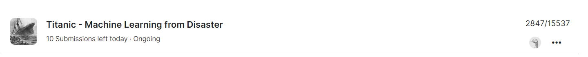

# Titanic - Machine Learning from Disaster
by: Niv Dobzinski (PhD)

This repository contains a complete solution for the Kaggle competition "Titanic: Machine Learning from Disaster" using the XGBoost algorithm. The solution includes data preprocessing, feature engineering, hyperparameter tuning, model training, evaluation, and submission preparation.

### The Challenge
The sinking of the Titanic is one of the most infamous shipwrecks in history. On April 15, 1912, during her maiden voyage, the widely considered "unsinkable" RMS Titanic sank after colliding with an iceberg. Unfortunately, there weren’t enough lifeboats for everyone onboard, resulting in the death of 1502 out of 2224 passengers and crew.

While there was some element of luck involved in surviving, it seems some groups of people were more likely to survive than others. In this challenge, we ask you to build a predictive model that answers the question: “what sorts of people were more likely to survive?” using passenger data (i.e., name, age, gender, socio-economic class, etc).

## Key Steps in the Process

### Data Preprocessing

- Handling missing values for categorical and numerical features.
- Feature engineering including family size, name length, and number of parts in the name.
- One-hot encoding for categorical variables.

### Model Training

- Splitting the data into training and validation sets.
- Hyperparameter tuning using GridSearchCV.
- Training the XGBoost classifier with the best hyperparameters.

### Model Evaluation

- Evaluating the model using accuracy score and classification report.
- Generating a confusion matrix and visualizing feature importance.

### Prediction and Submission

- Making predictions on the test dataset.
- Preparing and saving the submission file for Kaggle.

## Results

- **Validation Accuracy:** Achieved an accuracy score of 0.804 on the validation set.
- **Classification Report:**

          precision    recall  f1-score   support

       0       0.79      0.93      0.85       110
       1       0.84      0.61      0.71        69

accuracy                           0.80       179


- **Confusion Matrix:** Generated a confusion matrix to visualize the model performance.

## Files in the Repository

- `data/train.csv`: Training dataset.
- `data/test.csv`: Test dataset.
- `submission.csv`: Submission file with predictions.
- `titanic_notebook.ipynb`: Jupyter notebook containing the full solution.

## How to Use

1. Clone the repository:
  ```sh
  git clone https://github.com/yourusername/Titanic-Machine_Learning_from_Disaster.git
  ```

2. Ensure all dependencies are installed:
  ```sh
  pip install numpy pandas xgboost scikit-learn matplotlib
  ```

3. Adjust the file paths to your environment.

4. Run the Jupyter notebook to reproduce the solution and generate predictions for the Titanic dataset:
  ```sh
  jupyter notebook titanic_notebook.ipynb
  ```

- **Kaggle Competition Score:** 0.78
- **Public Leaderboard Score:** Top 18%

